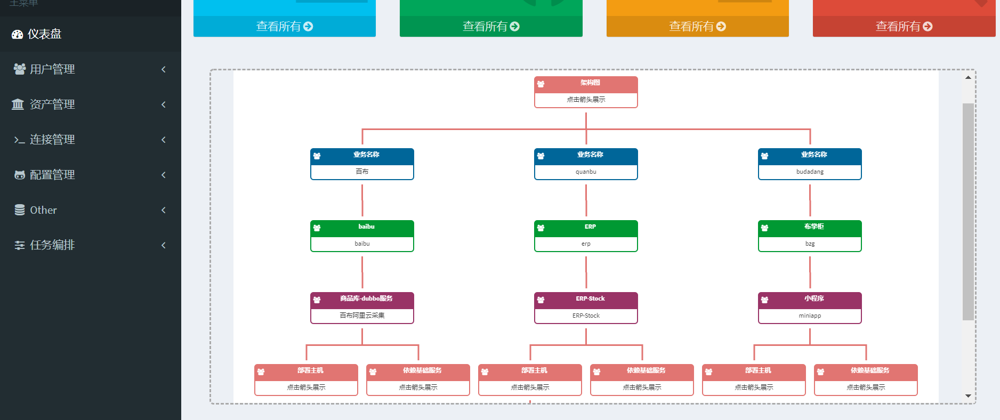

[OrgChart](https://github.com/dabeng/OrgChart) -- 树形结构图



```js
(function($) {
        $(function() {
            var ds = {
                    "name" : "业务名称",
                    "title": "baibu", 'className': 'middle-level',
                    "children" : [
                        
                            {
                                "name" : "项目名称",
                                "title": "blog", 'className': 'product-dept',
                                "children": [
                                    
                                        {
                                            "name" : "应用名称",
                                            "title" : "test", 'className': 'rd-dept',
                                            "children": [
                                                
                                                    {
                                                        "name":"部署主机",
                                                        "title":" seam.alongparty.cn",
                                                        "className": "pipeline1"
                                                    },
                                                
                                                
                                                    {
                                                        "name":"依赖基础服务",
                                                        "title":"mysql",
                                                        'className': 'frontend1',
                                                        "children": [
                                                            
                                                                {
                                                                    "name":"部署主机",
                                                                    "title": "seam.alongparty.cn",
                                                                    "className": "pipeline1"
                                                                },
                                                             
                                                                {
                                                                    "name":"部署主机",
                                                                    "title": "192.168.19.1",
                                                                    "className": "pipeline1"
                                                                },
                                                             
                                                        ]
                                                    },
                                                
                                            ]
                                        },
                                    
                                        {
                                            "name" : "应用名称",
                                            "title" : "open", 'className': 'rd-dept',
                                            "children": [
                                                
                                                    {
                                                        "name":"部署主机",
                                                        "title":" seam.alongparty.cn",
                                                        "className": "pipeline1"
                                                    },
                                                
                                                    {
                                                        "name":"部署主机",
                                                        "title":" 192.168.19.1",
                                                        "className": "pipeline1"
                                                    },
                                                
                                                
                                                    {
                                                        "name":"依赖基础服务",
                                                        "title":"mysql",
                                                        'className': 'frontend1',
                                                        "children": [
                                                            
                                                                {
                                                                    "name":"部署主机",
                                                                    "title": "seam.alongparty.cn",
                                                                    "className": "pipeline1"
                                                                },
                                                             
                                                                {
                                                                    "name":"部署主机",
                                                                    "title": "192.168.19.1",
                                                                    "className": "pipeline1"
                                                                },
                                                             
                                                        ]
                                                    },
                                                
                                                    {
                                                        "name":"依赖基础服务",
                                                        "title":"redis",
                                                        'className': 'frontend1',
                                                        "children": [
                                                            
                                                                {
                                                                    "name":"部署主机",
                                                                    "title": "seam.alongparty.cn",
                                                                    "className": "pipeline1"
                                                                },
                                                             
                                                                {
                                                                    "name":"部署主机",
                                                                    "title": "192.168.19.1",
                                                                    "className": "pipeline1"
                                                                },
                                                             
                                                        ]
                                                    },
                                                
                                            ]
                                        },
                                    
                                ]
                            },
                        
                    ]
            };
            var oc = $('#chart-container').orgchart({
                'data' : ds,
                'nodeContent': 'title',
                'visibleLevel':4//展开几级
            });

        });
    })(jQuery);
```

```html
    <link rel="icon" href="https://dabeng.github.io/OrgChart/img/logo.png">
    <link rel="stylesheet" href="https://dabeng.github.io/OrgChart/css/font-awesome.min.css">
    <link rel="stylesheet" href="https://cdnjs.cloudflare.com/ajax/libs/orgchart/2.1.6/css/jquery.orgchart.css">
    <link rel="stylesheet" href="https://dabeng.github.io/OrgChart/css/style.css">

    <style type="text/css">
    .orgchart { background: #fff; }
    .orgchart td.left, .orgchart td.right, .orgchart td.top { border-color: #aaa; }
    .orgchart td>.down { background-color: #aaa; }
    .orgchart .middle-level .title { background-color: #006699; }
    .orgchart .middle-level .content { border-color: #006699; }
    .orgchart .product-dept .title { background-color: #009933; }
    .orgchart .product-dept .content { border-color: #009933; }
    .orgchart .rd-dept .title { background-color: #993366; }
    .orgchart .rd-dept .content { border-color: #993366; }
    .orgchart .pipeline1 .title { background-color: #996633; }
    .orgchart .pipeline1 .content { border-color: #996633; }
    .orgchart .frontend1 .title { background-color: #cc0066; }
    .orgchart .frontend1 .content { border-color: #cc0066; }
  </style>
  
  <div id="chart-container"></div>
  <script type="text/javascript" src="https://cdn.bootcss.com/jquery/3.4.1/jquery.min.js"></script>
  <script type="text/javascript" src="https://cdnjs.cloudflare.com/ajax/libs/orgchart/2.1.6/js/jquery.orgchart.js"></script>

```